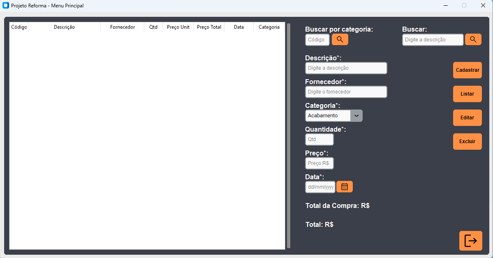

<h1>Projeto Reforma</h1>

  <h2>Imagem do sistema</h2>
  
  <h3>Objetivo do projeto</h3>
  
Apesar de ser um projeto simples, a construção desse software fez se necessária, para ajudar meus pais no gerenciamento dos gastos que tiveram durante o período de reforma da nossa casa. Isso se fez necessário, pois com o passar do tempo, o risco de extravio dessas notas é grande, além disso, a tinta do papel, acaba se desgastando, apagando informações importantes, como: Nome da loja onde o material foi adquirido, quantidade, valor, e data. Com isso, mesmo as notas se desgastando, as informações de materiais adquiridos estão registradas, para que eles possam visualizar de forma rápida e fácil a qualquer momento.

  <h3>Funcionalidades</h3>
  <ul>
    <li>Cadastrar Produto></li>
    <li>Exibir Produtos</li>
    <li>Exibir Produto</li>
    <li>Exibir Produtos por Categoria(Alvenaria ou Acabamento)</li>
    <li>Alterar</li>
    <li>Excluir</li>
    <li>Total de uma compra</li>
    <li>Total gasto</li>
  </ul>
  <h3>Tecnologias Utilizadas</h3>
  
  <h3>Autor</h3>
  
João Marcos.

